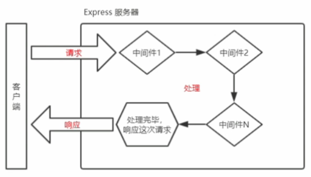
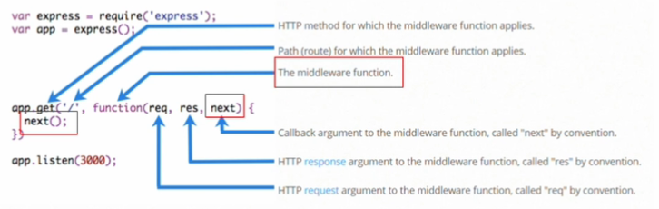

# Express 中间件

> Express 是基于 Nodejs 平台，快速、开放、极简的 Web 开发框架。

Express 的本质就是一个 npm 上的第三方包，提供快速创建 web 服务器的便捷方法。他的作用和 Nodejs 内置的 http 模块类似，专门用来创建 web 服务器。

## 中间件作用

业务处理过程中的中间环节，中间件必须有输入和输出，上一级的输出作为下一级的输入。

中间件作用就是在匹配路由之前或者之后做一系列操作。可以用来做权限判断，如果没有登陆就跳转到登陆页面，登陆鉴权通过就进入登陆以后的页面。

多个中间件之间共享一份 req、res，基于这样的特性，我们可以在上游的中间件中，统一为 req 和 res 对象添加自定义属性或方法，供下游的中间件或路由使用。

## 中间件分类

Express 常用的中间件有：

1. 应用级中间件
2. 路由级中间件
3. 错误处理中间件
4. 内置中间件
5. 第三方中间件

## 中间件的调用流程

当一个请求到达 Express 服务器之后，可以练习调用多个中间件，从而对此次请求进行预处理。


## 中间件的格式

Express 中间件，本质上就是一个 function 处理函数。

Express 中间件的格式如下：



> 中间件函数的形参列表中，必须包含 `next()`函数，而路由处理函数的形参列表中只有 `req` 和 `res`。

## next()函数的作用

`next()`函数，时实现`多个中间件`连续调用的关键，它表示把流转关系转交给下一个`中间件`或`路由`。

## 定义全局中间件

全局生效的中间件。客户端发起的任何请求，到达服务器之后，都会触发的中间件，叫做全局生效的中间件。
通过调用`app.use(中间件函数)`,即可定义一个全局生效的中间件。

```js
// 自定义中间件
const custonMW = (req, res, next) => {
  console.log('这是一个简单的自定义中间件函数')
  // 把流转关系转交给下一个中间件或路由
  next()
}

// 将custonMW中间件注册为全局生效的中间件
app.use(custonMW)
```

上面代码等效于：

```js
app.use((req, res, next) => {
  console.log('这是一个简单的自定义中间件函数')
  next()
})
```
