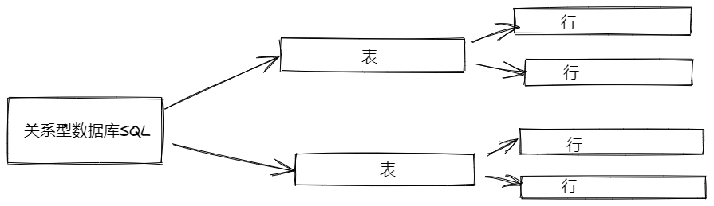
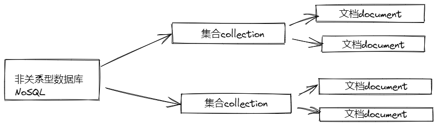

# MongoDB 基础

MongoDB 是非关系型数据库 NoSQL(Not Only SQL)，是以 key-value 形式存储，和传统的关系型数据路不同，不一定遵循传统数据库的一些基本要求
，比如：ACID 属性，表结构等等。

## 介绍

NoSQL 是最早被提出是在 20 世纪 80 年代，在当时更多强调的是与关系型数据库区别对待。在大数据时代有自己的意义。非结构性数据库没有行、列的概念，用 JSON 来存储数据，集合就相当于“表”，文档就相当于“行”。

SQL 数据库和 NoSQL 数据库：



MongoDB 是一个介于关系型数据库和非关系型数据库之间的产品，是非关系数据库中功能最丰富，最像关系数据库的 NoSQL 数据库。它支持的数据结构非常松散，是类似 json 和 bson 格式，因此可以存储比较复杂的数据类型。MongoDB 最大的特点是支持的查询语言十分强大，其语法类似于面向对象的查询语言，几乎可以实现类似关系数据库表单查询的绝大部分功能，而且还支持对数据简历索引。它的特点是：高性能、易部署、易使用，存储数据非常方便。

## 安装&配置

下载地址[MongoDB 下载](http://www.mongodb.com)
然后在系统环境变量配置 mongo 安装路径下的 bin 所在的路径。
然后在命令行输入`mongodb`,根据提示即可知道是否安装配置成功。

指令`show dbs`显示当前数据库列表，初始状态默认下有 admin、config、local 几个系统内置的数据库。

## 使用数据库

### 增加&查询操作

通过命令行工具使用 mongodb 进行增删改查。

1. 连接 mongodb 数据库：

```js
mongo
```

2. 查看数据库：

```js
show dbs
```

3. 切换数据库：

```js
use 数据库名
// use mydb // 切换到名为mydb的数据库
```

4. 向当前数据库中某集合插入数据：

```js
db.集合名.insert(数据)
// db.user.insert({name:"Tom",age:18}) // 向mydb数据库插入user集合，并向该插入插入一条数据
```

- 批量插入

```js
for (var i = 0; i < 100; i++) {
  db.user.insert({ name: 'zs' + i, age: i })
}
```

- 查看数据数量

```js
db.user.find().count()
```

5. 查看当前数据库集合列表：

```js
show collections
```

6. 查看当前数据库指定集合的数据列表：

```js
db.user.find()
```

7. 条件查询：

```js
db.user.find(条件)
// db.user.find({age:18}) // 查找user集合中age为18的数据
// db.user.find({age:{$gt:22}}) // 查找user集合中age大于22的数据
```

-大于：`$gt`

-大于等于：`$gte`

-小于：`$lt`

-小于等于：`$lte`

例子：
且条件：年龄大于等于 23 且小于等于 26

```js
db.user.find({ age: { $gte: 23, $lte: 26 } })
```

- 查询第一条数据

查询当前数据库 user 集合的第一条数据

```js
// 查询当前数据库 user 集合的第一条数据
db.user.findOne()
```

相当于：

```js
// 查询当前数据库 user 集合的第一条数据
db.user.find().limit(1)
```

- 或查询

  查询当前数据库 user 集合中 age=18 或者 age=20 的数据

  ```js
  // 查询当前数据库 user 集合中 age=18 或者 age=20 的数据
  db.user.find({ $or: [{ age: 18 }, { age: 20 }] })
  ```

1. 模糊查询

- 查询当前数据库 user 集合中 name 中包含 mongo 的数据

```js
// 查询当前数据库user集合中name中包含mongo的数据
db.user.find({ name: /mongo/ })
```

- 查询当前数据库 user 集合中 name 中以 mongo 开头的数据

```js
//查询当前数据库 user 集合中 name 中以 mongo 开头的数据
db.user.find({ name: /^mongo/ })
```

- 查询当前数据库 user 集合中 name 中以 mongo 结尾的数据

```js
//查询当前数据库 user 集合中 name 中以 mongo 结尾的数据
db.user.find({ name: /mongo$/ })
```

- 查询当前数据库 user 集合指定列 name、age 的数据

```js
//查询当前数据库 user 集合指定列 name、age 的数据
db.user.find({}, { name: 1, age: 1 })
```

- 查询当前数据库 user 集合 age 大于 18 同时指定列 name、age 的数据

```js
//查询当前数据库 user 集合指定列 name、age 的数据
db.user.find({ age: { $gt: 18 } }, { name: 1, age: 1 })
```

9. 排序
   1 是升序，-1 是降序

```js
db.user.find().sort({ age: 1 }) // 升序
db.user.find().sort({ age: -1 }) // 降序
```

10. 分页查询

- 查询前 10 条数据

```js
db.user.find().limit(10)
```

- 查询 10 条以后的数据

```js
db.user.find().skip(10)
```

limit 是 pageSize，skip 是第几页\*pageSize

```js
db.user.find().limit(10).skip(10)
```

### 修改操作

把 name=zs0 的数据的 age 改为 16：

```js
db.user.update({ name: 'zs0' }, { $set: { age: 16 } })
```

### 删除操作

11. 删除当前数据库的集合：

```js
db.集合名.drop()
```

12. 删除当前数据库：

```js
db.dropDatabase()
```
